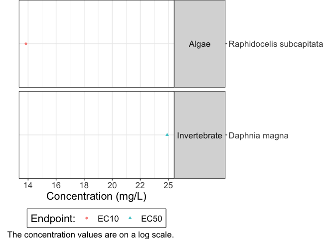
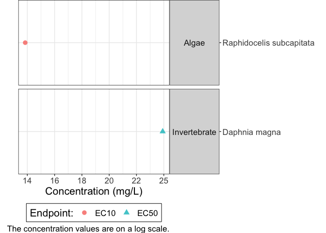

# wqbench

<!-- badges: start -->

[](https://github.com/bcgov/repomountie/blob/master/doc/lifecycle-badges.md)
[](https://github.com/poissonconsulting/wqbench/actions/workflows/R-CMD-check.yaml)
[](https://app.codecov.io/gh/poissonconsulting/wqbench?branch=main)
<!-- badges: end -->

## Installation

``` r
# install.packages("devtools")
devtools::install_github("bcgov/wqbench")
```

## Workflow

``` r
library(wqbench)
```

### Create Data Set for App

The `wqb_create_data_set()` function will download the US EPA
ECOTOX<sup>1</sup> database, create a local .sqlite database, add other
data sources and filter conditions, clean and process the data, classify
the duration, standardize the effect and output the completed data set
needed for the shinywqbench app. The function will create an RDS file of
the data set for ease of using the data and not having to download or
compile the data set as this takes several minutes.

The default for the `file_path` argument will save the raw text files at
`"~/Ecotoxicology/ecotox"`. The default for `folder_path` argument will
save the .sqlite database and RDS file is at
`"~/Ecotoxicology/ecotox_db/"`. The default value for version will
download the most recent version of the data set available on the
website.

``` r
data_set <- wqb_create_data_set()
```

To read in the data set after it has been created.

``` r
data_set <- readRDS("~/Ecotoxicology/ecotox_db/ecotox_ascii_03_15_2023.rds")
```

### Generate Benchmark

#### Deterministic Example

``` r
data <- wqb_filter_chemical(wqbenchdata::aquatic_data, "100016")
data <- wqb_benchmark_method(data)

data_agg <- wqb_aggregate(data) 
data_agg <- wqb_af(data_agg)
ctv <- wqb_generate_ctv(data_agg)
ctv
```

    ## # A tibble: 1 × 3
    ##   ctv_est_mg.L ctv_lcl_mg.L ctv_ucl_mg.L
    ##          <dbl>        <dbl>        <dbl>
    ## 1          2.5           NA           NA

Plot data set

``` r
wqb_plot(data)
```

<!-- -->

Plot the results

``` r
wqb_plot_det(data_agg)
```

<!-- -->

#### SSD Example

``` r
data <- wqb_filter_chemical(wqbenchdata::aquatic_data, "1071836")
data <- wqb_benchmark_method(data)

data_agg <- wqb_aggregate(data) 
data_agg <- wqb_af(data_agg)
ctv <- wqb_generate_ctv(data_agg)
ctv
```

    ## # A tibble: 1 × 3
    ##   ctv_est_mg.L ctv_lcl_mg.L ctv_ucl_mg.L
    ##          <dbl>        <dbl>        <dbl>
    ## 1       0.0101      0.00194       0.0573

Plot data set

``` r
wqb_plot(data)
```

<!-- -->

Plot the results

``` r
fit <- wqb_ssd_fit(data_agg)
wqb_plot_ssd(data_agg, fit)
```

<!-- -->

#### Benchmark Value

To calculate the benchmark for the chemical, divide the critical
toxicity value (ctv) by each assessment factor.

``` r
benchmark <-  ctv / (data_agg$af_bc_species * data_agg$af_salmon * data_agg$af_planktonic *data_agg$af_variation)
benchmark
```

    ##   ctv_est_mg.L ctv_lcl_mg.L ctv_ucl_mg.L
    ## 1   0.01014924  0.001939468   0.05726568

*SSD* method generates a lower and upper confidence interval
*Deterministic* method only generates an estimate

#### Summary Tables

``` r
wqb_summary_trophic_species(data_agg)
```

    ## # A tibble: 5 × 2
    ##   `Trophic Group` `Number of Species`
    ##   <fct>                         <int>
    ## 1 Algae                             6
    ## 2 Amphibian                         4
    ## 3 Fish                             11
    ## 4 Invertebrate                     12
    ## 5 Plant                             8

``` r
wqb_summary_trophic_groups(data_agg)
```

    ## # A tibble: 4 × 2
    ##   Consideration           Result                                                
    ##   <chr>                   <chr>                                                 
    ## 1 Trophic group(s)        Algae, Amphibian, Fish, Invertebrate, Plant           
    ## 2 Salmonid(s)             Oncorhynchus kisutch, Oncorhynchus mykiss, Oncorhynch…
    ## 3 Planktonic Invertebrate Artemia franciscana                                   
    ## 4 B.C. species            Cyprinus carpio, Lemna minor, Myriophyllum aquaticum,…

``` r
wqb_summary_af(data_agg)
```

    ## # A tibble: 3 × 3
    ##   Consideration                `Assessment Factor` Description                  
    ##   <chr>                                      <int> <chr>                        
    ## 1 Species variation factor                       1 Accounts for uncertainty due…
    ## 2 Ecological assessment factor                   1 Accounts for uncertainty whe…
    ## 3 B.C. species                                   1 Accounts for uncertainty of …

## Getting Help or Reporting an Issue

To report issues, bugs or enhancements, please file an
[issue](https://github.com/bcgov/wqbench/issues). Check out the
[support](https://github.com/bcgov/wqbench/blob/main/.github/SUPPORT.md)
for more info.

## Code of Conduct

Please note that the wqbench project is released with a [Contributor
Code of
Conduct](https://contributor-covenant.org/version/2/1/CODE_OF_CONDUCT.html).
By contributing to this project, you agree to abide by its terms.

## License

The code is released under the Apache License 2.0

> Copyright 2023 Province of British Columbia
>
> Licensed under the Apache License, Version 2.0 (the “License”); you
> may not use this file except in compliance with the License. You may
> obtain a copy of the License at
>
> <https://www.apache.org/licenses/LICENSE-2.0>
>
> Unless required by applicable law or agreed to in writing, software
> distributed under the License is distributed on an “AS IS” BASIS,
> WITHOUT WARRANTIES OR CONDITIONS OF ANY KIND, either express or
> implied. See the License for the specific language governing
> permissions and limitations under the License.

## Reference

1.  Olker, J. H., Elonen, C. M., Pilli, A., Anderson, A., Kinziger, B.,
    Erickson, S., Skopinski, M., Pomplun, A., LaLone, C. A., Russom, C.
    L., & Hoff, D. (2022). The ECOTOXicology Knowledgebase: A Curated
    Database of Ecologically Relevant Toxicity Tests to Support
    Environmental Research and Risk Assessment. Environmental Toxicology
    and Chemistry, 41(6):1520-1539. <https://doi.org/10.1002/etc.5324>
